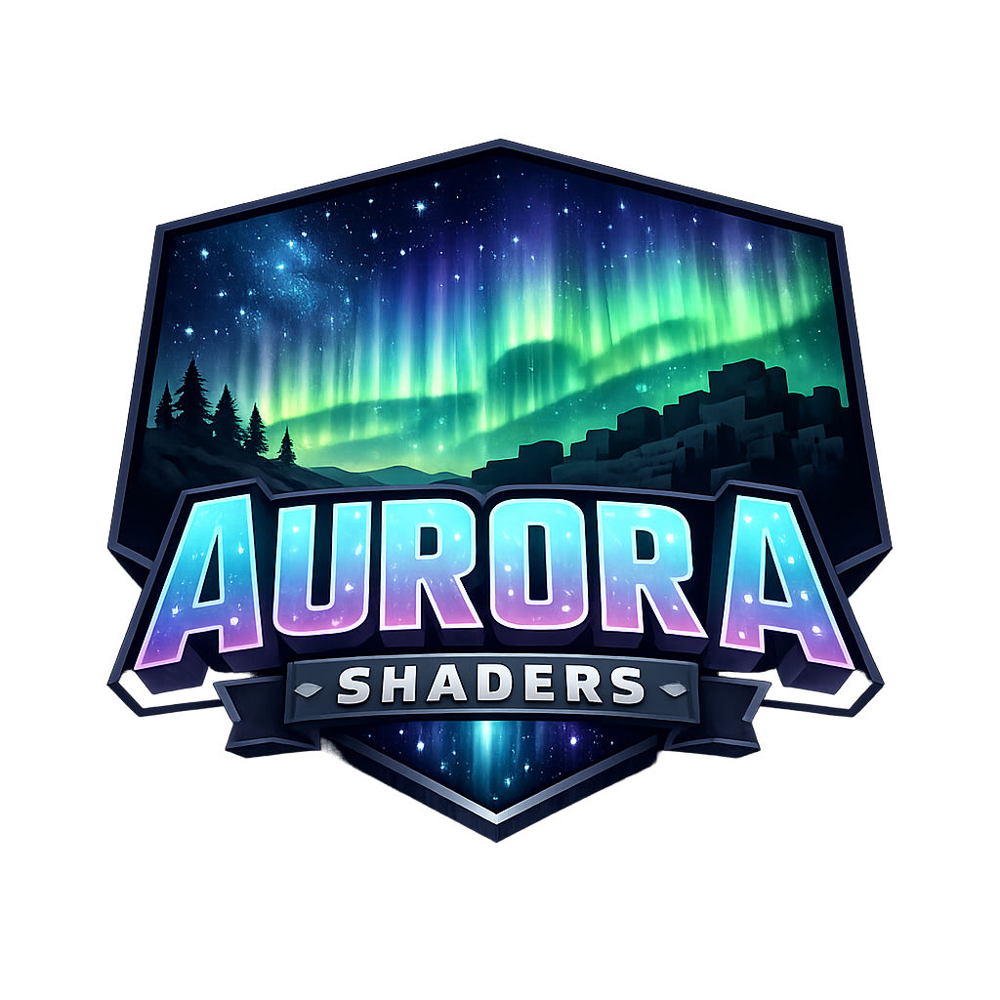

# Aurora Shaders

Aurora Shaders is a modern, client-side shader renderer for **Minecraft Forge 1.20.1 (Forge 47.0.0)**.
It provides a flexible OpenGL-based shader pipeline designed for post-processing effects, custom
visual styles, and future deferred rendering features.



---

## Features

- Custom GLSL shader pipeline (vertex + fragment)
- Fullscreen post-processing renderer
- Forge-native (no OptiFine required)
- Modular and extensible architecture
- UI foundation for shader configuration
- Designed for future effects:
  - Bloom
  - Volumetric lighting
  - Color grading
  - Temporal effects

---

## Requirements

- Minecraft `**1.20.1**`
- Forge `**47.0.0**`
- Java `**17**`
- GPU with `**OpenGL**` `3.2+` support

---

## Installation (Users)

1. Install **Minecraft Forge 47.0.0** for Minecraft 1.20.1
2. Download the Aurora Shaders `.jar`
3. Place it into your `.minecraft/mods` folder
4. Launch Minecraft

Aurora Shaders runs **client-side only**.

---

## Development Setup

```bash
git clone <your-repo-url>
cd aurora-shaders
./gradlew genIntelliJRuns
```
